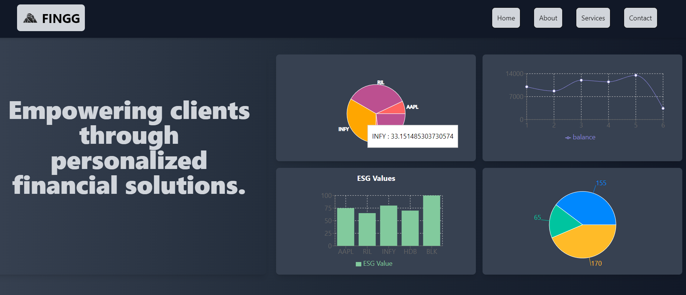
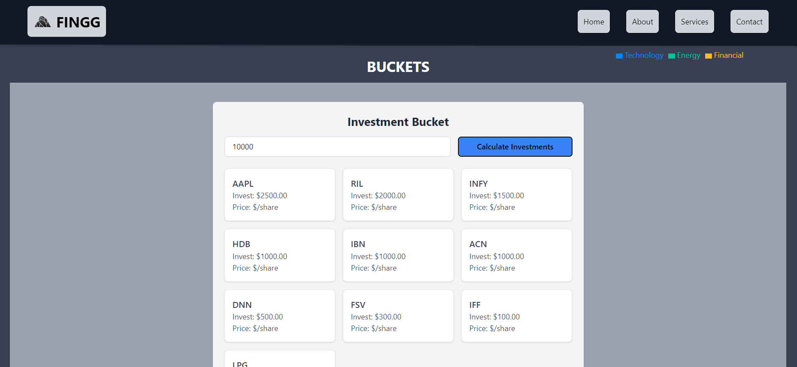
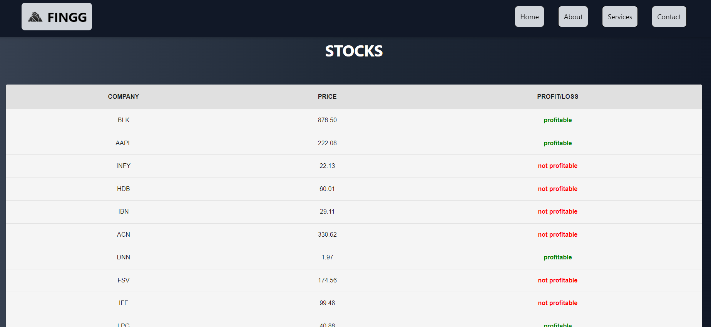
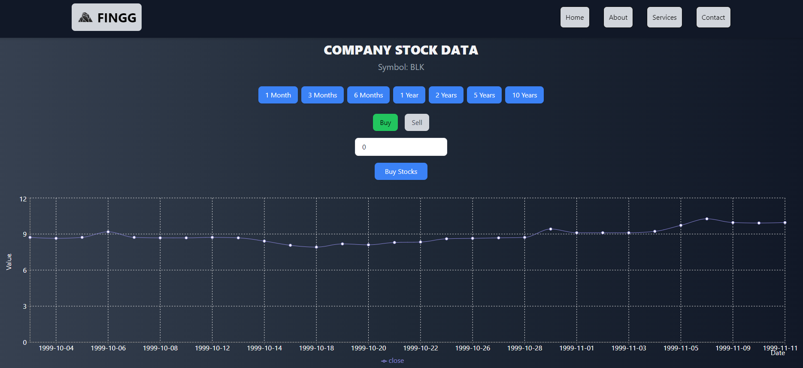
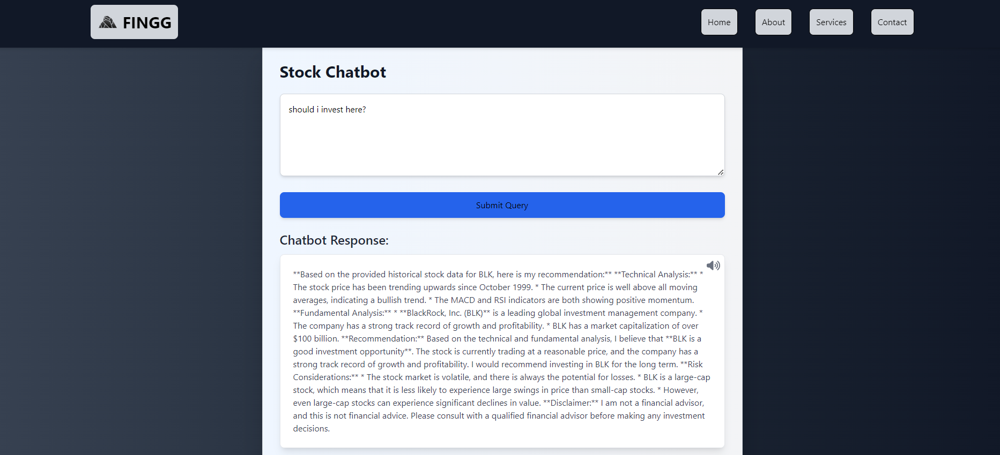

FINGG

This project is a web application designed to facilitate the visualization of company stock data and streamline the process of investing in stocks. The frontend of the application is built with Vite.js, ensuring fast and optimized performance. The backend is developed using Python, providing robust and efficient data processing. MongoDB is used as the database to store and manage stock data and user information.

A peek at the website:

Home

Create Buckets

View stocks

Buy and Sell Stocks

Personlised Chatbot

